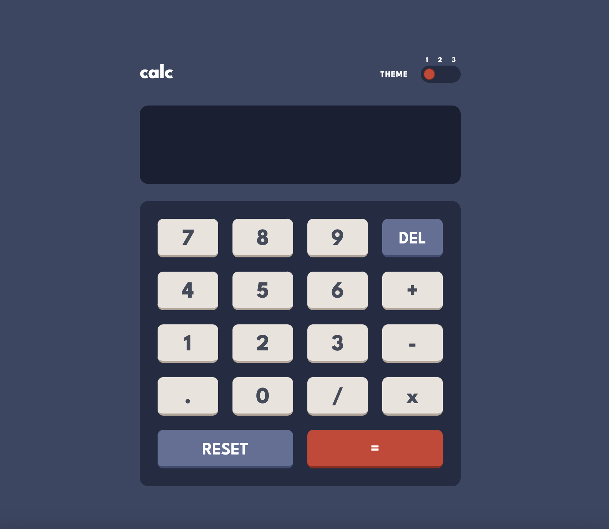
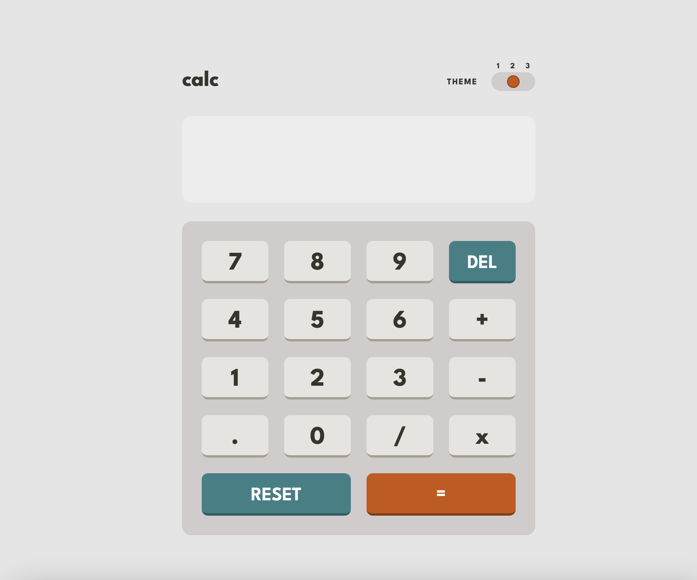
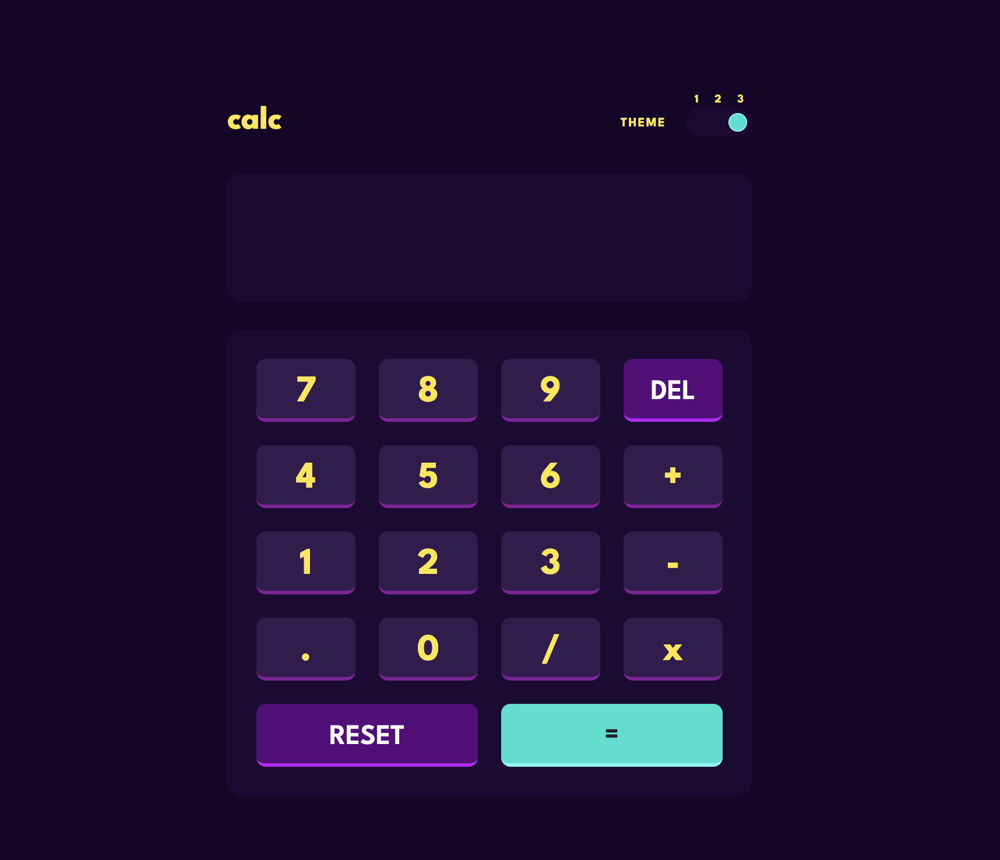

# Frontend Mentor - Calculator app solution

This is a solution to the [Calculator app challenge on Frontend Mentor](https://www.frontendmentor.io/challenges/calculator-app-9lteq5N29). Frontend Mentor challenges help you improve your coding skills by building realistic projects. 

## Table of contents

- [Overview](#overview)
  - [The challenge](#the-challenge)
  - [Screenshot](#screenshot)
  - [Links](#links)
- [Getting started](#getting-started)  
  - [Installation](#installation)
- [My process](#my-process)
  - [Built with](#built-with)
  - [Useful resources](#useful-resources)
- [Author](#author)

## Overview

### The challenge

Users should be able to:

- See the size of the elements adjust based on their device's screen size
- Perform mathmatical operations like addition, subtraction, multiplication, and division
- Adjust the color theme based on their preference
- **Bonus**: Have their initial theme preference checked using `prefers-color-scheme` and have any additional changes saved in the browser

### Screenshots





### Links

- Solution URL: [https://github.com/doehna/calculator-app-main](https://github.com/doehna/calculator-app-main)
- Live Site URL: [https://doehna.github.io/calculator-app-main/](https://doehna.github.io/calculator-app-main/)

## Getting started

To get a local copy up and running follow these simple example steps.

### Installation

- Clone the repo
git clone https://github.com/doehna/calculator-app-main.git

- Install NPM packages
```npm install```

- Start parcel server
```npm start```

## My process

### Built with

- Semantic HTML5 markup
- Tailwind
- JavaScript
- Flexbox
- CSS Grid
- Mobile-first workflow

### Useful resources

- [tw-colors](https://www.npmjs.com/package/tw-colors) - helped with managing themes with tailwind

## Author

- Website - [Dorota Wojdecka](https://github.com/doehna)
- Frontend Mentor - [@doehna](https://www.frontendmentor.io/profile/doehna)
